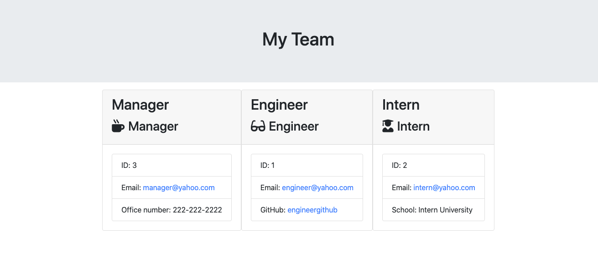

# employee_template_genertor
Generate profiles HTML file using node.js

# Criteria provided by client:
A user wants to create an HTML file using a command line application to have access to the team information. The user wants to capture information for the roles: Engineer, Intern, and Manager. The application should allow to generate one or multiple roles.

# How to use this application
* Use the app.js file
* Ensure to install NPM and Iquirer
* Anwser the first question "Choose A Profile"
* Enter the information for each role
* The "TEAM.HMTL" will be created under the outout folder

# Animated GIF of the application

# TEAM file example

# Repository
* Repository: https://github.com/CivicaJR91/employee_template_genertor
* Employee_Template_Video: https://drive.google.com/file/d/1lDX8H4I8nQcoYz1fzXp5ERToJcmjnRQQ/view?usp=sharing
* Profile Repository: https://civicajr91.github.io/Janliz-Suarez-Portfolio/